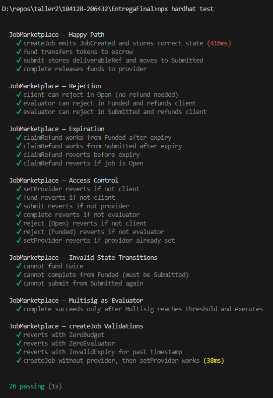

# Job Marketplace — Entrega Final

Marketplace de empleos sobre Ethereum inspirado en ERC-8183, orientado a un flujo de escrow entre tres roles principales:

* **Cliente**: publica un trabajo, define el presupuesto y fondea el escrow.
* **Proveedor**: acepta o recibe un trabajo asignado y entrega el resultado.
* **Evaluador**: revisa la entrega y decide si libera el pago al proveedor o reembolsa al cliente.

El pago de los trabajos se realiza con un token ERC-20 definido al momento de desplegar el contrato `JobMarketplace`.

---

## Requisitos previos

Antes de levantar el proyecto se necesita tener instalado:

* Node.js version 22.14.0
* npm
* Una wallet compatible con Ethereum, por ejemplo MetaMask
* ETH de Sepolia para pagar gas si se despliega o usa la app en Sepolia
* Una cuenta en Alchemy, Infura u otro proveedor RPC
* Una cuenta en WalletConnect Cloud
* Una cuenta en Pinata, si se van a subir entregables a IPFS

---

## Contratos desplegados en Sepolia

| Contrato        | Dirección                                                           |
| --------------- | ------------------------------------------------------------------- |
| MockERC20 / MKT | `0x99697bcab73B1Cdd33f47ddb29118022a3B23405`                        |
| JobMarketplace  | `0xdeE7B4abf8ad3a8957027936c92024483EF629b4`                        |
| Multisig        | `[COMPLETAR: dirección del contrato Multisig si se usa en Sepolia]` |

> Si se vuelve a desplegar alguno de los contratos, estas direcciones deben actualizarse también en el `.env` del frontend.

---

## Configuración de variables de entorno

El proyecto usa dos archivos `.env`:

1. `.env` en la raíz de `EntregaFinal`.
2. `.env` dentro de `EntregaFinal/frontend`.

Los archivos `.env` no deben subirse al repositorio si contienen claves privadas, JWTs, API keys o cualquier otro secreto.

---

## `.env` general del proyecto

Ubicación:

```bash
EntregaFinal/.env
```

Ejemplo:

```env
SEPOLIA_RPC_URL=[Dejar el actual]
PRIVATE_KEY=[COMPLETAR: private key de una wallet de desarrollo]
ETHERSCAN_API_KEY=[COMPLETAR: API key de Etherscan, si aplica]
```

### Variables

| Variable            |                    Obligatoria | Descripción                                                                                                       | De dónde obtenerla                                                                                    |
| ------------------- | -----------------------------: | ----------------------------------------------------------------------------------------------------------------- | ----------------------------------------------------------------------------------------------------- |
| `SEPOLIA_RPC_URL`   |               Sí, para Sepolia | URL RPC usada por Hardhat para conectarse a Sepolia.                                                              | Crear una app/proyecto en Alchemy, Infura u otro proveedor RPC y copiar el endpoint HTTPS de Sepolia. |
| `PRIVATE_KEY`       |     Sí, para deploy en Sepolia | Clave privada de la cuenta que va a desplegar los contratos. Esa cuenta debe tener ETH de Sepolia para pagar gas. | Desde la wallet usada para desarrollo. No usar una wallet personal con fondos reales.                 |
| `ETHERSCAN_API_KEY` | Opcional / según configuración | API key usada si se verifica el contrato en Etherscan o si algún script la requiere.                              | Crear una cuenta en Etherscan y generar una API key desde el panel de API Keys.                       |

### Cómo obtener `SEPOLIA_RPC_URL`

1. Entrar al panel del proveedor RPC elegido, por ejemplo Alchemy.
2. Crear una app para la red **Ethereum Sepolia**.
3. Copiar el endpoint HTTPS.
4. Pegar ese valor en `SEPOLIA_RPC_URL`.

Ejemplo de formato:

```env
SEPOLIA_RPC_URL=https://eth-sepolia.g.alchemy.com/v2/[COMPLETAR_API_KEY]
```

### Cómo obtener `PRIVATE_KEY`

1. Crear o elegir una cuenta de desarrollo en la wallet.
2. Exportar la private key desde la wallet.
3. Pegarla en `PRIVATE_KEY`.

Ejemplo de formato:

```env
PRIVATE_KEY=[COMPLETAR_PRIVATE_KEY]
```

> No compartir esta clave, no subirla al repositorio y no usar una wallet con fondos reales.

### Cómo obtener `ETHERSCAN_API_KEY`

1. Entrar a Etherscan.
2. Crear o iniciar sesión con una cuenta.
3. Ir a la sección de API Keys.
4. Crear una nueva key.
5. Copiar el valor generado en `ETHERSCAN_API_KEY`.

Si el proyecto no verifica contratos automáticamente, esta variable puede quedar como placeholder.

---

## `.env` del frontend

Ubicación:

```bash
EntregaFinal/frontend/.env
```

Ejemplo:

```env
VITE_JOB_MARKETPLACE_ADDRESS=[COMPLETAR: dirección del contrato JobMarketplace]
VITE_TOKEN_ADDRESS=[COMPLETAR: dirección del contrato MockERC20/MKT]
VITE_MULTISIG_ADDRESS=[COMPLETAR: dirección del contrato Multisig, si aplica]
VITE_WALLETCONNECT_PROJECT_ID=[COMPLETAR: Project ID de WalletConnect]
VITE_APP_NAME=Job Marketplace
VITE_DEPLOY_BLOCK=[COMPLETAR: bloque del deploy de JobMarketplace]
VITE_PINATA_JWT=[COMPLETAR: JWT de Pinata]
```

### Variables

| Variable                        |        Obligatoria | Descripción                                                                                                    | De dónde obtenerla                                                                             |
| ------------------------------- | -----------------: | -------------------------------------------------------------------------------------------------------------- | ---------------------------------------------------------------------------------------------- |
| `VITE_JOB_MARKETPLACE_ADDRESS`  |                 Sí | Dirección del contrato `JobMarketplace` desplegado.                                                            | Sale en consola al ejecutar el script de deploy. También se puede buscar en Sepolia Etherscan. |
| `VITE_TOKEN_ADDRESS`            |                 Sí | Dirección del token ERC-20 usado para pagar los trabajos.                                                      | Sale en consola al ejecutar el script de deploy del `MockERC20`.                               |
| `VITE_MULTISIG_ADDRESS`         |           Opcional | Dirección del contrato Multisig de la Entrega 2. Permite usarlo como evaluador.                                | Deploy de la Entrega 2 o dirección ya publicada en Sepolia.                                    |
| `VITE_WALLETCONNECT_PROJECT_ID` |                 Sí | ID del proyecto usado para conexión de wallet.                                                                 | WalletConnect Cloud.                                                                           |
| `VITE_APP_NAME`                 |                 Sí | Nombre visible de la aplicación.                                                                               | Valor libre. Para esta entrega: `Job Marketplace`.                                             |
| `VITE_DEPLOY_BLOCK`             |                 Sí | Número de bloque en el que fue desplegado `JobMarketplace`. Se usa para leer eventos desde un punto razonable. | Sepolia Etherscan, en la transacción de deploy.                                                |
| `VITE_PINATA_JWT`               | Sí, si se usa IPFS | JWT usado por el frontend para subir entregables a Pinata.                                                     | Pinata Cloud, sección Developers / API Keys.                                                   |

---

## Cómo obtener las direcciones de los contratos

Después de ejecutar el deploy, la consola muestra las direcciones desplegadas.

Ejemplo de salida esperada:

```bash
MockERC20 deployed to: 0x...
JobMarketplace deployed to: 0x...
```

Esos valores se copian al `.env` del frontend:

```env
VITE_TOKEN_ADDRESS=0x...
VITE_JOB_MARKETPLACE_ADDRESS=0x...
```

Si se despliega también el Multisig, copiar su dirección en:

```env
VITE_MULTISIG_ADDRESS=0x...
```

Si no se usa Multisig desde el frontend, dejar:

```env
VITE_MULTISIG_ADDRESS=
```

o mantener un placeholder claro.

---

## Cómo obtener `VITE_DEPLOY_BLOCK`

`VITE_DEPLOY_BLOCK` debe ser el número de bloque donde se desplegó el contrato `JobMarketplace`.

Para obtenerlo:

1. Ir a Sepolia Etherscan.
2. Buscar la dirección del contrato `JobMarketplace`.
3. En la sección **More Info**, buscar el campo **Contract Creator**.
4. Hacer clic en el link de la transacción de creación, donde aparece algo como “hace X minutos”.
5. En la página de la transacción, buscar el campo **Block**.
6. Copiar ese número en `VITE_DEPLOY_BLOCK`.

Ejemplo:

```env
VITE_DEPLOY_BLOCK=11096447
```

En Hardhat local puede usarse:

```env
VITE_DEPLOY_BLOCK=0
```

En Sepolia no conviene dejar `0`, porque el frontend intentaría leer eventos desde el bloque génesis. Eso puede hacer que la carga sea lenta o que se consuman límites del RPC.

Actualizar `VITE_DEPLOY_BLOCK` cuando:

* Se redeploya `JobMarketplace`.
* Se cambia de red.
* Se pasa de entorno local a Sepolia.
* Se reemplaza la dirección del contrato en `VITE_JOB_MARKETPLACE_ADDRESS`.

---

## Cómo obtener `VITE_WALLETCONNECT_PROJECT_ID`

1. Entrar a WalletConnect Cloud.
2. Crear un nuevo proyecto.
3. Copiar el **Project ID**.
4. Pegar el valor en:

```env
VITE_WALLETCONNECT_PROJECT_ID=[COMPLETAR_PROJECT_ID]
```

---

## Cómo obtener `VITE_PINATA_JWT`

Pinata se usa para subir el contenido de los entregables a IPFS.

Para obtener el JWT:

1. Entrar a Pinata Cloud.
2. Ir a **Developers**.
3. Entrar a **API Keys**.
4. Crear una nueva key.
5. Para esta entrega, usar una key con permisos suficientes para subir archivos.
6. Copiar el valor **JWT** o **Secret Access Token**.
7. Pegar el valor en:

```env
VITE_PINATA_JWT=[COMPLETAR_PINATA_JWT]
```

El JWT debe actualizarse si:

* Expiró.
* Fue revocado.
* Se eliminó la API key.
* Se quiere usar otra cuenta de Pinata.

Si los uploads fallan con error `401`, revisar primero esta variable.

---

## Instalación

Desde la raíz del repositorio:

```bash
cd EntregaFinal
npm install
```

Luego instalar las dependencias del frontend:

```bash
cd frontend
npm install
```

---

## Correr tests

Desde `EntregaFinal`:

```bash
npm install
npx hardhat test
```

Los tests cubren:

* Happy path: `createJob` → `fund` → `submit` → `complete`.
* Rechazo en estado `Open` por parte del cliente.
* Rechazo en estado `Funded` por parte del evaluador.
* Rechazo en estado `Submitted` por parte del evaluador.
* Expiración con `claimRefund` desde `Funded`.
* Expiración con `claimRefund` desde `Submitted`.
* Control de acceso sobre funciones restringidas.
* Uso del Multisig de la Entrega 2 como evaluador.
* Ejecución de `complete` solamente después de alcanzar el threshold del Multisig.

Evidencia de ejecución:



---

## Compilar contratos

Desde `EntregaFinal`:

```bash
npx hardhat compile
```

---

## Ejecutar en entorno local

Para correr la aplicación contra una blockchain local de Hardhat se recomienda usar dos terminales.

### Terminal 1 — levantar nodo local

Desde `EntregaFinal`:

```bash
npx hardhat node
```

Dejar esta terminal abierta.

### Terminal 2 — deploy local

Desde `EntregaFinal`:

```bash
npx hardhat run scripts/deploy.ts --network localhost
```

Copiar de la salida de consola:

```bash
MockERC20 deployed to: 0x...
JobMarketplace deployed to: 0x...
```

Actualizar el archivo `frontend/.env`:

```env
VITE_TOKEN_ADDRESS=0x...
VITE_JOB_MARKETPLACE_ADDRESS=0x...
VITE_DEPLOY_BLOCK=0
```

Luego iniciar el frontend:

```bash
cd frontend
npm run dev
```

Abrir en el navegador la URL que indique Vite en consola.

---

## Ejecutar en Sepolia

### 1. Configurar `.env` general

En `EntregaFinal/.env`:

```env
SEPOLIA_RPC_URL=[COMPLETAR_RPC_SEPOLIA]
PRIVATE_KEY=[COMPLETAR_PRIVATE_KEY]
ETHERSCAN_API_KEY=[COMPLETAR_ETHERSCAN_API_KEY_SI_APLICA]
```

La cuenta correspondiente a `PRIVATE_KEY` debe tener ETH de Sepolia para pagar gas.

### 2. Deployar contratos en Sepolia

Desde `EntregaFinal`:

```bash
npx hardhat run scripts/deploy.ts --network sepolia
```

Copiar las direcciones que aparecen en consola:

```bash
MockERC20 deployed to: 0x...
JobMarketplace deployed to: 0x...
```

### 3. Obtener el bloque de deploy

Buscar la dirección de `JobMarketplace` en Sepolia Etherscan y copiar el campo **Block** desde la transacción de creación del contrato.

### 4. Configurar `frontend/.env`

```env
VITE_JOB_MARKETPLACE_ADDRESS=0x...
VITE_TOKEN_ADDRESS=0x...
VITE_MULTISIG_ADDRESS=[COMPLETAR: dirección del Multisig si aplica]
VITE_WALLETCONNECT_PROJECT_ID=[COMPLETAR_PROJECT_ID]
VITE_APP_NAME=Job Marketplace
VITE_DEPLOY_BLOCK=[COMPLETAR_BLOCK_NUMBER]
VITE_PINATA_JWT=[COMPLETAR_PINATA_JWT]
```

### 5. Iniciar frontend

```bash
cd frontend
npm install
npm run dev
```

Abrir en el navegador la URL indicada por Vite.

---

## Flujo de uso de la aplicación

### 1. Conectar wallet

Al abrir la aplicación, conectar una wallet compatible.

La wallet debe estar en la red correspondiente:

* Hardhat local, si se está usando `localhost`.
* Sepolia, si se está usando el deploy en testnet.

---

### 2. Ver tablero de trabajos

En el tablero se listan los trabajos creados leyendo eventos `JobCreated`.

Para cada trabajo se muestra:

* Descripción.
* Budget.
* Estado.
* Dirección del cliente.

---

### 3. Publicar un trabajo

Desde la pantalla de publicación, el cliente carga:

* Descripción.
* Presupuesto.
* Dirección del evaluador.
* Dirección del proveedor, opcional.
* Fecha de expiración.

El campo `evaluator` es obligatorio.

El campo `provider` es opcional. Si se deja vacío, el proveedor puede asignarse después mientras el trabajo siga en estado `Open`.

---

### 4. Asignar proveedor

Si el trabajo fue creado sin proveedor, el cliente puede asignarlo usando `setProvider`.

Condiciones:

* El trabajo debe estar en estado `Open`.
* El trabajo no debe tener proveedor asignado previamente.
* Solo el cliente puede ejecutar esta acción.

---

### 5. Fondear trabajo

El cliente puede fondear el trabajo usando el botón correspondiente.

El flujo ocurre en dos transacciones si el allowance no alcanza:

1. `approve` sobre el token ERC-20.
2. `fund` sobre el contrato `JobMarketplace`.

La wallet puede pedir confirmar dos transacciones.

Después de confirmar, el trabajo queda fondeado y el proveedor puede enviar la entrega.

---

### 6. Enviar entrega

El proveedor envía el contenido del entregable desde el panel de acciones.

El frontend realiza el siguiente flujo:

1. Sube el archivo o contenido a Pinata.
2. Pinata devuelve un CID de IPFS.
3. El frontend guarda el CID localmente.
4. El frontend calcula el hash del CID.
5. El contrato recibe el `deliverableRef` como `bytes32`.

El contrato no guarda el contenido completo del entregable, solo la referencia hasheada.

---

### 7. Revisar entrega

El evaluador recibe o ingresa el CID del entregable.

Con ese CID puede recuperar el contenido desde IPFS y verificar que coincide con el `deliverableRef` guardado on-chain.

Luego puede:

* Aprobar la entrega con `complete`.
* Rechazar la entrega con `reject`.

Si aprueba, los fondos se liberan al proveedor.

Si rechaza, los fondos vuelven al cliente.

---

### 8. Reclamar reembolso por expiración

Si el trabajo está en `Funded` o `Submitted` y ya pasó `expiresAt`, cualquier cuenta puede llamar a `claimRefund`.

Esta función:

* No tiene control de acceso.
* No depende de hooks externos.
* Reembolsa al cliente.
* Pasa el trabajo a estado expirado.

---

### 9. Usar Multisig como evaluador

El evaluador de un trabajo puede ser una wallet común o un contrato.

Para usar el Multisig de la Entrega 2:

1. Desplegar o identificar el contrato Multisig.
2. Usar la dirección del Multisig como `evaluator` al crear el trabajo.
3. Cuando el trabajo esté en `Submitted`, preparar el llamado a `complete(jobId, reason)`.
4. Crear la propuesta en el Multisig.
5. Aprobar la propuesta hasta alcanzar el threshold.
6. Ejecutar la propuesta desde el Multisig.

El contrato `JobMarketplace` no necesita lógica especial para Multisig. Simplemente valida que quien llama sea la dirección configurada como evaluador.

---

## Comandos útiles

### Instalar dependencias del contrato

```bash
cd EntregaFinal
npm install
```

### Compilar contratos

```bash
npx hardhat compile
```

### Correr tests

```bash
npx hardhat test
```

### Levantar nodo local

```bash
npx hardhat node
```

### Deploy local

```bash
npx hardhat run scripts/deploy.ts --network localhost
```

### Deploy en Sepolia

```bash
npx hardhat run scripts/deploy.ts --network sepolia
```

### Instalar dependencias del frontend

```bash
cd frontend
npm install
```

### Correr frontend

```bash
npm run dev
```

---

## Decisiones de diseño

### ERC-20 definido en el deploy

El token de pago se fija en el constructor de `JobMarketplace`.

Esto mantiene el escrow simple y predecible, porque todos los trabajos usan el mismo token ERC-20.

---

### Budget inmutable

El presupuesto del trabajo se define al crear el job y no se modifica después.

Esto evita inconsistencias entre lo publicado por el cliente, lo fondeado en escrow y lo esperado por el proveedor.

---

### Errores personalizados

Se utilizan errores personalizados en lugar de strings de revert.

Esto mejora la claridad del ABI y reduce costos de gas frente a mensajes de error como strings.

---

### ReentrancyGuard en funciones que mueven fondos

Las funciones que transfieren tokens o modifican fondos del escrow deben evitar reentrancy.

Aplica para operaciones como:

* `fund`
* `complete`
* `reject`
* `claimRefund`

Funciones como `submit` o `setProvider` no mueven fondos directamente.

---

### `claimRefund` sin control de acceso

`claimRefund` puede ser llamada por cualquier cuenta.

La decisión evita que el reembolso pueda quedar bloqueado por permisos, hooks o dependencias externas. Si el trabajo expiró, los fondos deben poder volver al cliente.

---

### `reject` unificado

Se usa una única función `reject(jobId, reason)`.

La lógica depende del estado del trabajo:

* En `Open`, puede rechazar el cliente.
* En `Funded` o `Submitted`, puede rechazar el evaluador.

---

### Multisig como evaluador

El Multisig se integra naturalmente porque el evaluador es una dirección.

Si esa dirección pertenece a un contrato Multisig, entonces la aprobación del trabajo requiere que el Multisig ejecute la llamada a `complete`.

No se necesita una integración especial dentro de `JobMarketplace`.

---

### Proveedor opcional

El proveedor puede ser definido al crear el trabajo o asignarse después mediante `setProvider`.

Una vez que el proveedor queda definido y el trabajo avanza, no se permite reemplazarlo arbitrariamente.

---

### IPFS para entregables

Los entregables se almacenan fuera de la blockchain.

En esta implementación se usa IPFS mediante Pinata:

* El contenido se sube a Pinata.
* Se obtiene un CID.
* El contrato guarda una referencia `bytes32`.
* El contenido puede recuperarse luego usando el CID.

Esto evita guardar contenido pesado directamente on-chain.

---

### Actualización del estado sin recargar la página

Después de una transacción exitosa, el frontend actualiza la información del trabajo sin recargar toda la aplicación.

---

### Manejo claro de errores

Cuando una transacción revierte, el frontend muestra el error de forma clara para el usuario.

---

## Desvíos de la especificación

### `reject` recibe `bytes32 reason`

La especificación menciona `reject(jobId, reason)` sin indicar explícitamente el tipo de `reason`.

Se implementa como `bytes32` para mantener consistencia con `complete(jobId, reason)`, donde `reason` también funciona como una atestación `bytes32`.

---

### `setProvider` solo permite asignar si no hay proveedor previo

La consigna indica que `setProvider` asigna proveedor a un trabajo `Open` que aún no tiene proveedor.

Por eso, si el proveedor ya fue asignado en `createJob` o mediante una llamada anterior a `setProvider`, no se permite sobrescribirlo.

---

### IPFS en lugar de `localStorage` como almacenamiento principal

La consigna permite manejar el delivery off-chain y menciona `localStorage`, base de datos o IPFS como alternativas.

Esta implementación usa IPFS vía Pinata porque es una opción más alineada con un flujo descentralizado.

El frontend puede guardar el CID localmente como ayuda para la sesión, pero la referencia real del entregable queda asociada al CID publicado en IPFS.

---

## Información requerida por la consigna

### Instrucciones para correr tests

Ver sección:

```md
Correr tests
```

---

### Instrucciones para correr frontend localmente

Ver secciones:

```md
Ejecutar en entorno local
Ejecutar en Sepolia
```

---

### Direcciones en Sepolia de ambos contratos

Ver sección:

```md
Contratos desplegados en Sepolia
```

---

### Decisiones de diseño

Ver sección:

```md
Decisiones de diseño
```

---

### Desvíos de la especificación

Ver sección:

```md
Desvíos de la especificación
```

---

## Troubleshooting

### El frontend no muestra trabajos

Revisar:

* Que `VITE_JOB_MARKETPLACE_ADDRESS` sea la dirección correcta.
* Que la wallet esté en la red correcta.
* Que `VITE_DEPLOY_BLOCK` corresponda al deploy actual.
* Que el contrato haya emitido eventos `JobCreated`.
* Que el RPC configurado no esté bloqueando o limitando las consultas.

---

### El frontend tarda demasiado en cargar trabajos

Probablemente `VITE_DEPLOY_BLOCK` esté en `0` usando Sepolia.

Buscar el bloque real de deploy en Sepolia Etherscan y actualizar:

```env
VITE_DEPLOY_BLOCK=[COMPLETAR_BLOCK_NUMBER]
```

---

### Fallan los uploads a Pinata

Revisar:

* Que `VITE_PINATA_JWT` esté configurado.
* Que el JWT no haya expirado.
* Que la API key no haya sido revocada.
* Que la cuenta de Pinata tenga permisos para subir archivos.

---

### La transacción de deploy falla en Sepolia

Revisar:

* Que `SEPOLIA_RPC_URL` sea válido.
* Que `PRIVATE_KEY` corresponda a una cuenta con ETH de Sepolia.
* Que la wallet tenga fondos suficientes para gas.
* Que la red configurada en Hardhat sea `sepolia`.

---

### La acción de fondear falla

Revisar:

* Que el cliente tenga tokens `MKT` suficientes.
* Que el contrato del token sea el correcto.
* Que la wallet conectada sea la del cliente.
* Que el trabajo esté en estado `Open`.
* Que se haya confirmado el `approve` antes de llamar a `fund`.

[COMPLETAR: explicar cómo obtener o mintear tokens MKT para la cuenta cliente si el proyecto lo requiere.]

---

## Notas de seguridad

* No subir archivos `.env` reales al repositorio.
* No compartir `PRIVATE_KEY`.
* No usar wallets personales con fondos reales para pruebas.
* Regenerar cualquier clave privada, JWT o API key que haya sido expuesta accidentalmente.
* Usar cuentas de desarrollo separadas para Sepolia.
* Revisar que los valores públicos del README sean únicamente direcciones de contratos o datos no sensibles.
