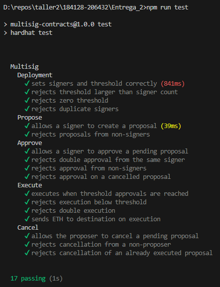

# Entrega 2 — Contrato Multisig

Proyecto realizado por:

* Diego Gasaniga - 181428
* Juan Pablo Barrios - 206432

---

## Contrato Multisig

El contrato implementa un esquema multisig programático en Solidity.

La lista de signers se define al momento del despliegue y el threshold indica la cantidad mínima de aprobaciones necesarias para ejecutar una propuesta.

La decisión tomada fue utilizar **signers fijos**, es decir, la lista de signers no puede modificarse luego del despliegue.

---

## Compilar, Testear y Desplegar el Contrato

### Instalar dependencias

```bash
cd Entrega_2
npm install
```

### Compilar el contrato

```bash
npm run compile
```

### Ejecutar los tests

```bash
npm run test
```

Los tests validan el comportamiento principal del contrato: despliegue, creación de propuestas, aprobación, ejecución, cancelación, y rechazo de acciones inválidas como aprobaciones duplicadas o acciones realizadas por no-signers.

Evidencia de ejecución de los tests:



### Configurar variables de entorno

El archivo `.env` ya se encuentra creado en el proyecto.

Antes de desplegar, completar los valores correspondientes con los datos propios:

```env
SEPOLIA_RPC_URL=https://sepolia.infura.io/v3/TU_KEY
PRIVATE_KEY=tu_clave_privada
ETHERSCAN_API_KEY=tu_api_key_de_etherscan
```

### Configurar signers y threshold

Antes de desplegar el contrato, modificar el archivo:

```text
scripts/deploy.ts
```

En ese archivo se debe editar el arreglo `signerAddresses`, agregando o quitando las direcciones de las wallets que se quieran usar como signers del contrato:

```ts
const signerAddresses: string[] = [
  '0x447b46E7a4C959fE30eBCdF01eA2B83eDFC2FC8a',
  '0x1066594e4483AE78eb21ECE5F475f8f9b5c8224d',
  '0x5478eEE9fbe0c2a994395A1848c62583F376fa2F',
  '0x0f1925e7003fbF4b4315409A3c78e65bd1F4B4dB',
];
```

También se debe ajustar el valor de `threshold`, que indica cuántas aprobaciones son necesarias para poder ejecutar una propuesta:

```ts
const threshold = 2;
```

El `threshold` debe ser menor o igual a la cantidad de direcciones configuradas en `signerAddresses`.

### Desplegar en Sepolia

```bash
npm run deploy:sepolia
```

El script imprimirá la dirección del contrato desplegado. Esa dirección debe configurarse luego en el `.env` del frontend como `VITE_CONTRACT_ADDRESS`.

---

## Ejecutar el Frontend Localmente

### Instalar dependencias

```bash
cd Entrega_2/frontend
npm install
```

### Configurar variables de entorno

El archivo `.env` ya se encuentra creado dentro de la carpeta del frontend.

Completar los valores correspondientes:

```env
VITE_WALLETCONNECT_PROJECT_ID=tu_project_id_de_walletconnect
VITE_CONTRACT_ADDRESS=0xDireccionDelContratoEnSepolia
VITE_APP_NAME=Multisig
```

El valor de `VITE_CONTRACT_ADDRESS` debe coincidir con la dirección del contrato desplegado en Sepolia.

### Iniciar el frontend

```bash
npm run dev
```

La aplicación queda disponible en:

```text
http://localhost:5173
```

---

## Contrato Desplegado en Sepolia

| Campo                  | Valor                                        |
| ---------------------- | -------------------------------------------- |
| Dirección del contrato | `0xCDB036F530aA064857D4A56Df757DeA65478b938` |
| Red                    | Sepolia Testnet                              |
| Chain ID               | `11155111`                                   |
| Threshold              | `2 de 4`                                     |

---

## Wallets para Interactuar

| # | Dirección                                    |
| - | -------------------------------------------- |
| 1 | `0x447b46E7a4C959fE30eBCdF01eA2B83eDFC2FC8a` |
| 2 | `0x1066594e4483AE78eb21ECE5F475f8f9b5c8224d` |
| 3 | `0x5478eEE9fbe0c2a994395A1848c62583F376fa2F` |
| 4 | `0x0f1925e7003fbF4b4315409A3c78e65bd1F4B4dB` |
